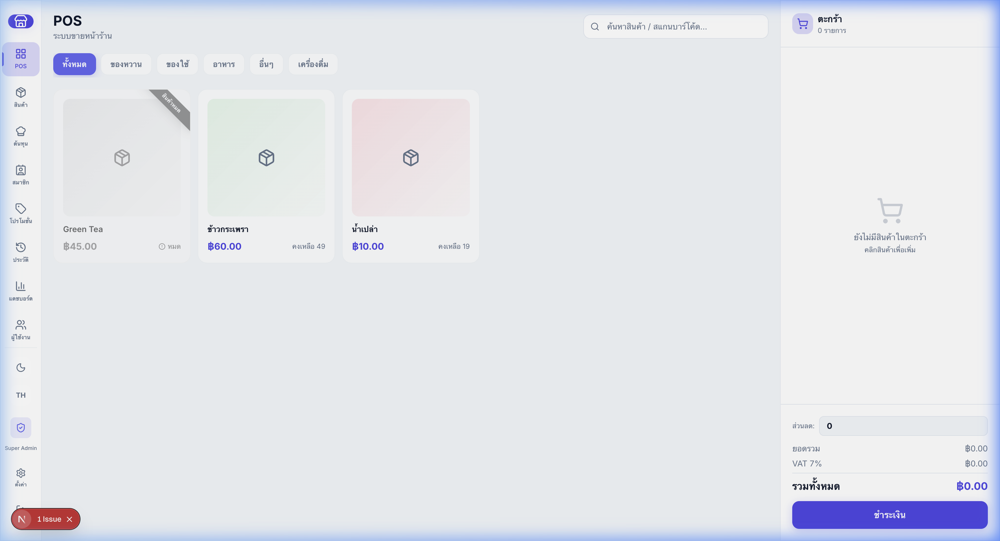

# POS Online - ระบบจัดการร้านค้าอัจฉริยะ (Point of Sale System)



ระบบขายหน้าร้าน (POS) แบบครบวงจรที่พัฒนาด้วยเทคโนโลยี Web Application สมัยใหม่ ออกแบบมาให้ใช้งานง่าย รวดเร็ว และตอบโจทย์ธุรกิจขนาดเล็กถึงขนาดกลาง (SMEs) โดยมีฟีเจอร์ที่ครอบคลุมตั้งแต่การขายสินค้า, บริหารสต๊อก, เก็บประวัติการขาย ไปจนถึงหน้าแดชบอร์ดสรุปยอด

## 🌟 ฟีเจอร์หลัก (Features)

- **🛒 ระบบขายหน้าร้าน (Point of Sale)**
  - หน้าจอเครื่องคิดเงินแบบเรียบง่าย (Minimal Classic Glassmorphism Design)
  - ค้นหาสินค้าได้ด้วยการพิมพ์ชื่อ, SKU, หรือสแกน Barcode
  - รองรับการคิดคลิกเพิ่ม/ลดจำนวนสินค้า, คิดภาษี (VAT 7%) และส่วนลดท้ายบิล
  - มีช่องทางการชำระเงินให้เลือก (เงินสด, บัตรเครดิต, พร้อมเพย์)
- **📦 ระบบจัดการคลังสินค้า (Product & Inventory)**
  - เพิ่ม แก้ไข ลบ ข้อมูลสินค้า (รองรับการอัพโหลดรูปภาพ)
  - สร้างรหัสสินค้า (SKU) อัตโนมัติตามหมวดหมู่
  - ตัดสต็อกทันทีที่มีการสั่งซื้อสำเร็จ
  - ระบบคำนวณต้นทุนวัตถุดิบ (Cost & Recipe Calculator)
- **👥 ระบบสมาชิกและโปรโมชั่น (CRM & Promotions)**
  - สมัครสมาชิกใหม่ รับแต้มโบนัสแรกเข้าทันที (Configurable Bonus)
  - ระบบสะสมแต้มอัจฉริยะ (Advanced Points System) คำนวณตามยอดซื้อจริง
  - **ระบบตัดแต้มแบบ FIFO (First-In, First-Out)**: หักแต้มที่ใกล้หมดอายุก่อนอัตโนมัติ
  - แบ่งระดับสมาชิก (BASIC, SILVER, GOLD, PLATINUM) ตามยอดใช้จ่ายสะสม
  - จัดการส่วนลดและโปรโมชั่นแบบยืดหยุ่น (Percentage / Fixed Amount)
- **⚙️ ระบบตั้งค่าผู้จัดการ (Admin Settings UI)**
  - ปรับแต่งกฎการให้แต้มได้เอง (ยอดซื้อกี่บาท = 1 แต้ม)
  - กำหนดอายุการใช้งานของแต้ม และแต้มโบนัสแรกเข้า
  - ตั้งค่าเบอร์ PromptPay สำหรับสร้าง QR Code รับเงิน
- **📊 แดชบอร์ดสรุปยอดขาย (Analytics Dashboard)**
  - ดูกราฟสรุปรายได้, สัดส่วนหมวดหมู่สินค้ายอดฮิต (Recharts: Bar Chart / Pie Chart)
  - สลับดูข้อมูลแบบ วันนี้ / เดือนนี้ / ปีนี้ ได้แบบ Real-time
  - บันทึกข้อมูลออกเป็นไฟล์ Excel/CSV (Export CSV)
- **🖨️ ระบบพิมพ์ใบเสร็จ (Receipt Printing)**
  - รองรับ Form Factor เพื่อพิมพ์สลิปกระดาษความร้อนหน้ากว้าง 80mm
- **🌓 อื่นๆ**
  - สลับโหมดสว่าง-มืด (Light/Dark Mode) อย่างสมบูรณ์
  - รองรับ 2 ภาษา (เปลี่ยนได้ระหว่าง ไทยและอังกฤษ)
  - มีการกั้นสิทธิ์ผู้ใช้งาน (Role-based: Admin, Manager, Cashier)

---

## 🛠️ เทคโนโลยีที่ใช้ (Tech Stack)

### Frontend

- [Next.js](https://nextjs.org/) (App Router & React)
- [Tailwind CSS](https://tailwindcss.com/) (Styling)
- [Zustand](https://github.com/pmndrs/zustand) (State Management)
- [Recharts](https://recharts.org/) (Data Visualization)
- [Lucide React](https://lucide.dev/) (Icons)

### Backend (อยู่ระหว่างการพัฒนาโครงสร้าง)

- [NestJS](https://nestjs.com/) (Node.js framework)
- [Prisma](https://www.prisma.io/) (ORM)
- [PostgreSQL](https://www.postgresql.org/) (Database)

---

## 🚀 วิธีการติดตั้งและรันโปรเจกต์ (Installation & Getting Started)

โปรเจกต์นี้ถูกออกแบบเป็น **Monorepo** โดยแบ่งเป็นโฟลเดอร์ `frontend` และ `backend` ในการรันบนเครื่อง Local ให้ทำตามขั้นตอนดังนี้:

### ข้อกำหนดเบื้องต้น (Prerequisites)

- ติดตั้ง [Node.js](https://nodejs.org/) (เวอร์ชัน 18+ ขึ้นไป)
- (แนะนำ) ขับเคลื่อนแพ็คเกจด้วย [Bun](https://bun.sh/) หรือใช้ `npm` ตามปกติได้เลย

### 1. โคลน Repository

```bash
git clone https://github.com/Nakarin1997/pos-online.git
cd pos-online
```

### 2. เตรียมฐานข้อมูล PostgreSQL

รันเฉพาะฐานข้อมูลผ่าน Docker Compose ก่อนการรันแอปพลิเคชัน:

```bash
docker-compose up -d pos-db
```

### 3. รันส่วนของ Frontend

```bash
cd frontend

# ติดตั้ง dependencies
bun install

# รัน Development Server
bun run dev
```

> สามารถเปิดบราวเซอร์และเข้าสู่ระบบด้วยที่อยู่ `http://localhost:3000`
> **ข้อมูลสำหรับทดสอบล็อกอิน (Demo Account):**
> อีเมล: admin@pos.com (หรือกรอกเบอร์ PIN: `1111`)

### 4. รันส่วนของ Backend

```bash
cd backend

# ติดตั้ง dependencies
bun install

# ซิงค์ Prisma Schema ไปยังฐานข้อมูล
bunx prisma db push

# รัน Development Server
bun run start:dev
```

### 🐳 5. รันทุกอย่างผ่าน Docker (สำหรับ Production / Deployment)

หากต้องการรันแอปพลิเคชันทั้งหมดผ่าน Docker Compose สามารถทำได้ผ่านคำสั่งเดียว:

```bash
# รันระบบเบื้องหลัง (Detached mode)
docker-compose up -d --build

# ดู Log การทำงานของระบบ
docker-compose logs -f

# หยุดการทำงาน
docker-compose down
```

> ระบบจะรัน Frontend ที่พอร์ต `http://localhost:3000` และ Backend ที่พอร์ต `http://localhost:3002`

---

## 👨‍💻 ข้อมูลติดต่อ (Contact)

จัดทำโดย [Nakarin1997](https://github.com/Nakarin1997)
หากมีข้อสงสัยหรือเสนอฟีเจอร์ สามารถเปิด Issue ได้บนหน้า GitHub ครับ.
